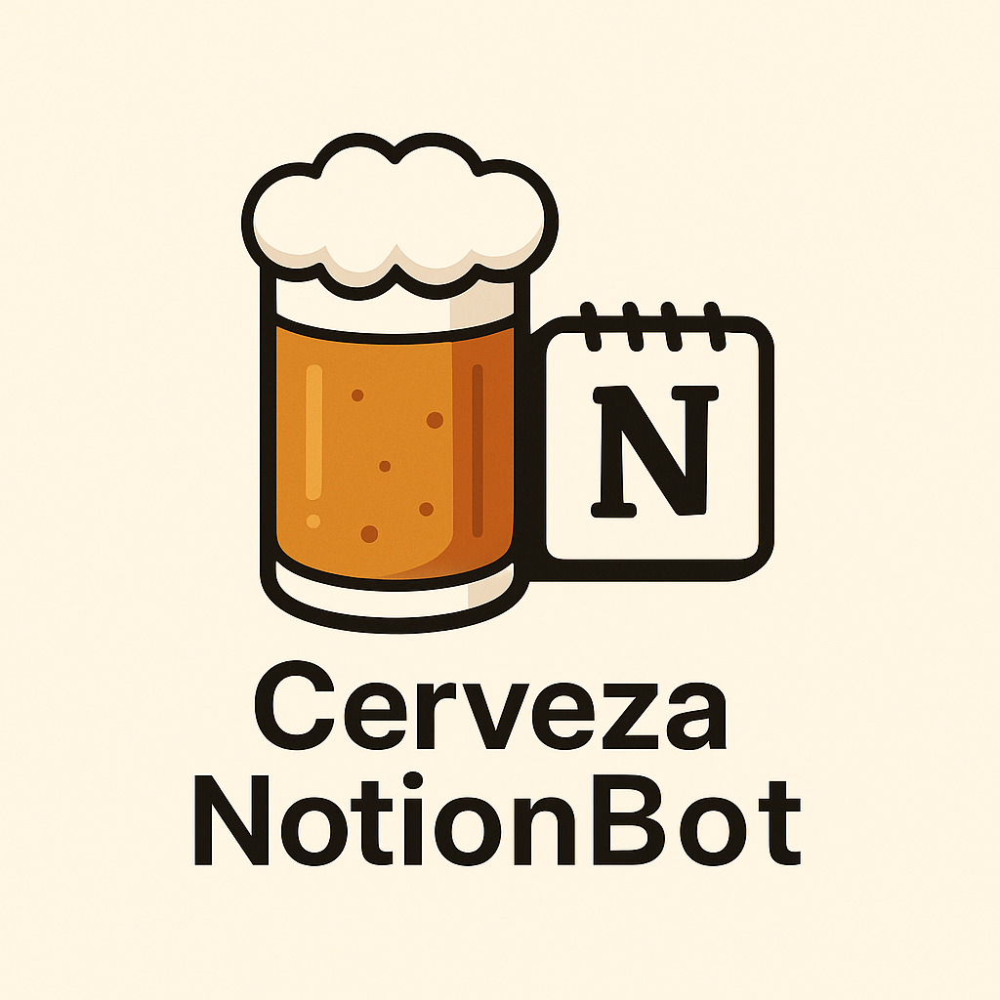

<!-- Encabezado -->
[![Colaboradores][contributors-shield]][contributors-url]
[![Forks][forks-shield]][forks-url]
[![Estrellas][stars-shield]][stars-url]
[![Issues][issues-shield]][issues-url]
[![MIT License][license-shield]][license-url]

<!-- Título -->
<br />
<div align="center">

<h1 align="center">cerveza-notion-bot</h1>

  <p align="center">
    Bot de Telegram que registra cervezas artesanales a partir de una imagen y guarda sus datos en Notion.
    <br />
    
    <br />
    <a href="https://github.com/andres-merino/cerveza-notion-bot/issues">Reportar un Problema</a>
  </p>
</div>

<!-- Cuerpo -->
## Sobre el Proyecto

Este proyecto permite registrar cervezas artesanales a partir de una imagen (etiqueta o carta). El sistema extrae automáticamente el nombre de la cerveza, sus grados de alcohol (ABV), su IBU y el lugar donde fue consumida, registrando todo en una base de datos de Notion.

El flujo incluye:
- Preguntar al usuario dónde está.
- Procesar una imagen enviada por Telegram.
- Usar GPT-4o para identificar los datos de las cervezas.
- Guardar automáticamente cada cerveza como una entrada en Notion.

### Construido con

 
 


## Descripción

El bot inicia solicitando el lugar donde el usuario está probando cerveza. Luego, al recibir una imagen de etiquetas o carta cervecera, GPT-4o analiza el contenido y extrae una lista de cervezas con nombre, ABV e IBU. Finalmente, toda la información se registra automáticamente en Notion con el lugar incluido.

### Contenido del Repositorio

- [`notion_uploader.ipynb`](/notion_uploader.ipynb): Notebook interactivo para desarrollo y pruebas.
- [`notion_image_uploader.py`](/notion_image_uploader.py): Script de línea de comandos para uso desde terminal.
- [`bot_uploader.py`](/bot_uploader.py): Bot de Telegram para enviar imágenes y registrarlos directamente en Notion.
- [`requirements.txt`](/requirements.txt): Lista de dependencias necesarias para ejecutar el proyecto.


### Configuración (`keys.py`)

Antes de ejecutar el proyecto, crea un archivo llamado `keys.py` con el siguiente contenido:

```python
OPENAI_API_KEY = "..."      # Tu clave API de OpenAI
NOTION_TOKEN = "..."        # Token de integración de Notion
NOTION_DATABASE_ID = "..."  # ID de la base de datos de Notion
TELEGRAM_TOKEN = "..."      # Token del bot de Telegram
USUARIO_AUTORIZADO = "..."  # Tu ID personal de Telegram
```

### Uso desde terminal

```bash
python notion_image_uploader.py ruta/al/archivo.jpg
```

### Uso desde Telegram

Crea un bot privado, configura tu `BOT_TOKEN` y tu `USUARIO_AUTORIZADO` en `keys.py`, y ejecuta:

```bash
python bot_uploader.py
```

Desde Telegram:

 * Envía `/start`
 * Indica tu ubicación o el lugar donde estás
 * Envía una foto de la carta o etiquetas
 * Las cervezas se registrarán automáticamente en Notion

Solo tú podrás interactuar con el bot gracias al control de acceso por ID.

## Créditos

**Andrés Merino** ([aemerinot@gmail.com](mailto:aemerinot@gmail.com))

* Docente-Investigador en Pontificia Universidad Católica del Ecuador
* Fundador del [Proyecto Alephsub0](https://www.alephsub0.org/about/)

[![LinkedIn][linkedin-shield]][linkedin-url-aemt]

## Licencia

Distribuido bajo la licencia MIT.

[![MIT License][license-shield]][license-url]

<!-- MARKDOWN LINKS & IMAGES -->

[contributors-shield]: https://img.shields.io/github/contributors/andres-merino/cerveza-notion-bot.svg?style=for-the-badge
[contributors-url]: https://github.com/andres-merino/cerveza-notion-bot/graphs/contributors
[forks-shield]: https://img.shields.io/github/forks/andres-merino/cerveza-notion-bot.svg?style=for-the-badge
[forks-url]: https://github.com/andres-merino/cerveza-notion-bot/forks
[stars-shield]: https://img.shields.io/github/stars/andres-merino/cerveza-notion-bot?style=for-the-badge
[stars-url]: https://github.com/andres-merino/cerveza-notion-bot/stargazers
[issues-shield]: https://img.shields.io/github/issues/andres-merino/cerveza-notion-bot.svg?style=for-the-badge
[issues-url]: https://github.com/andres-merino/cerveza-notion-bot/issues
[license-shield]: https://img.shields.io/github/license/andres-merino/cerveza-notion-bot.svg?style=for-the-badge
[license-url]: https://es.wikipedia.org/wiki/Licencia_MIT
[linkedin-shield]: https://img.shields.io/badge/linkedin-%230077B5.svg?style=for-the-badge&logo=linkedin&logoColor=white
[linkedin-url-aemt]: https://www.linkedin.com/in/andrés-merino-010a9b12b/
